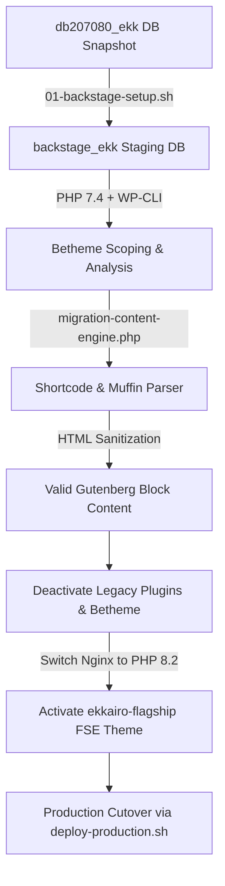

# Software Architecture Specification: EKK Flagship Theme (`ekkairo-flagship`)

## 1. Overview

The `ekkairo-flagship` theme is a custom, lightweight WordPress Block Theme (FSE - Full Site Editing) designed specifically for the Greek Community of Cairo (**EKK**) portal.

---

## 2. Directory Structure

```
ekkairo-flagship/
├── .agents/               # Agent skills & workflows
├── assets/                # CSS, JS, fonts, and images
│   ├── css/
│   ├── js/
│   └── images/
├── bin/                   # Shell and PHP CLI migration/ops scripts
│   ├── 01-backstage-setup.sh
│   ├── deploy-production.sh
│   ├── scope-betheme-config.php
│   ├── scope-legacy-items.php
│   ├── migration-content-engine.php
│   └── migration-helpers.php
├── blocks/                # Custom Gutenberg block definitions & PHP renders
├── parts/                 # FSE HTML template parts (header, footer, sidebar)
├── patterns/              # PHP block pattern registrations
├── templates/             # FSE HTML page templates (front-page, single, page, index, archive, 404)
├── ARCHITECTURE.md        # This document
├── DOS_AND_DONTS.md       # Development rules & standards
├── master_plan.md         # Master project roadmap & milestone gates
├── spec-phase1.md         # Specification for Phase 1
├── functions.php          # Theme setup & PHP registrations
├── package.json           # Local build tooling (JS/CSS compiler)
├── style.css              # Main stylesheet header
└── theme.json             # FSE design tokens & global settings
```

---

## 3. Technology Stack & Dependencies

- **Runtime Target**: PHP 8.2 (Post-migration) / PHP 7.4 (Pre-migration compatibility)
- **CMS Engine**: WordPress 6.0+ (Gutenberg Block Architecture)
- **Theme Paradigm**: Full Site Editing (FSE)
- **Styling**: `theme.json` design tokens + modular Vanilla CSS (Zero heavy utility frameworks)
- **Build Pipeline**: Node.js `npm` for asset compilation in development environment; pre-built production assets committed in Git.

---

## 4. Execution Lifecycle & Data Flow



---

## 5. Security & Performance Policies

1. **Zero Raw SQL Mutations**: All database updates during migration use WP-CLI or standard WordPress database abstractions (`$wpdb->prepare()`).
2. **Escaping & Sanitization**: All custom block render callbacks enforce strict output escaping (`esc_html`, `esc_attr`, `wp_kses_post`).
3. **No Unsanitized Gutenberg Markup**: Content generated by migration tools is validated against `wp_check_invalid_gutenberg_blocks` to avoid block recovery prompts in the WP Block Editor.
