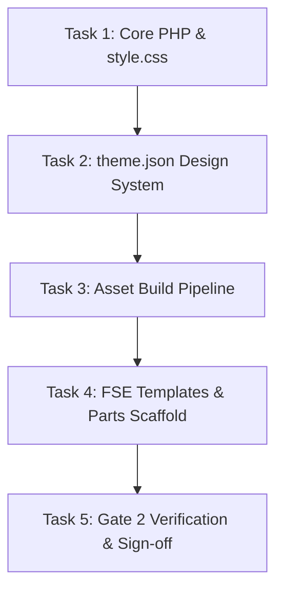

# Phase 2 Plan: Theme Scaffolding & Core Architecture

**TOPIC NAME**: ekkairo-flagship  
**ISSUE NAME**: phase2-theme-scaffolding-core-architecture  

---

## 1. Objective

Build the core WordPress Full Site Editing (FSE) block theme structure for `ekkairo-flagship`, configure `theme.json` design tokens, establish the `@wordpress/scripts` Node asset compilation pipeline, and create baseline FSE templates and template parts.

---

## 2. Assumptions & Architecture Options

### Stated Assumptions
1. **PHP Compatibility**: `functions.php` and theme files must maintain strict compatibility with PHP 8.2 (using `declare(strict_types=1);`), while remaining syntax-safe under PHP 7.4 during the staging migration phase.
2. **Schema Version**: `theme.json` will be formatted using schema version 3 (WordPress 6.6+ standard).
3. **Asset Compilation**: Build artifacts generated in `build/` via `@wordpress/scripts` will be committed to Git to support Node-free production deployments.
4. **Text Domain**: All internationalization functions will use `ekkairo-flagship`.

### Architecture Trade-Off Options (Presented for Awareness)
- **Option A (Pure Native FSE - Recommended)**: Use HTML block templates (`templates/*.html`, `parts/*.html`) with zero legacy PHP template wrappers. Cleanest block theme model, full Site Editor compatibility.
- **Option B (Hybrid FSE Theme)**: Mix classic PHP template hierarchy with Gutenberg block template parts. (Higher maintenance overhead, not required here).

---

## 3. Vertical Work Slices & Tasks

### Task 1: Core Theme Metadata & PHP Entrypoint (`style.css` & `functions.php`)
- **Deliverables**:
  - `style.css`: WordPress theme header block with `Theme Name: EKK Flagship Theme`, `Version: 1.0.0`, `Requires PHP: 8.2`, `Text Domain: ekkairo-flagship`.
  - `functions.php`: PHP 8.2 strict typing (`declare(strict_types=1);`), theme setup hook (`add_theme_support('wp-block-styles')`, `add_theme_support('editor-styles')`, `add_theme_support('post-thumbnails')`), block asset enqueuing logic (`wp_enqueue_script`, `wp_enqueue_style`).
- **Acceptance Criteria**:
  - `php -l functions.php` returns no syntax errors.
  - Theme header metadata recognized by WordPress theme parser.
- **Verification**: `php -l functions.php` & WP-CLI theme inspection.

### Task 2: Global Design System (`theme.json`)
- **Deliverables**:
  - `theme.json` version 3 schema setup.
  - Color Palette: EKK Brand primary colors (`#003366`, `#C5A059`, neutrals `#FFFFFF`, `#1A1A1A`, `#F4F6F8`).
  - Typography: Fluid font scale, custom font families (Inter/Roboto baseline), font sizes (`small`, `medium`, `large`, `x-large`, `xx-large`), line heights.
  - Layout & Spacing: Content width `1200px`, Wide width `1400px`, spacing scale presets (20, 30, 40, 60, 80, etc.).
  - Block Styles: Specific presets for `core/button`, `core/heading`, `core/paragraph`, `core/group`.
- **Acceptance Criteria**:
  - Valid JSON formatting and adherence to WP `theme.json` v3 schema.
- **Verification**: JSON syntax check via `jq` / Node validation script.

### Task 3: Asset Compilation Pipeline (`package.json` & `@wordpress/scripts`)
- **Deliverables**:
  - `package.json` configured with `@wordpress/scripts` dev dependency.
  - Scripts: `"build": "wp-scripts build"`, `"start": "wp-scripts start"`.
  - Source structure: `src/index.js` and `src/index.scss` / `src/index.css`.
  - Executed compilation producing `build/index.js` and `build/index.css`.
  - Git configuration ensuring `build/` directory is tracked and committed.
- **Acceptance Criteria**:
  - `npm run build` finishes with exit code 0 and populates `build/`.
- **Verification**: Command line `npm run build` execution & file exist checks.

### Task 4: FSE Directory & HTML Template Scaffold
- **Deliverables**:
  - Directory structure: `templates/`, `parts/`, `patterns/`, `blocks/`.
  - Template parts: `parts/header.html` (header layout with site title and nav), `parts/footer.html` (footer layout with copyright notice).
  - Templates: `templates/index.html`, `templates/front-page.html`, `templates/single.html`, `templates/page.html`, `templates/archive.html`, `templates/404.html`.
- **Acceptance Criteria**:
  - All template files use valid Gutenberg block markup tags (`<!-- wp:template-part ... -->`, `<!-- wp:group ... -->`, `<!-- wp:post-title ... -->`).
- **Verification**: WP-CLI / Block markup structure validation.

### Task 5: Gate 2 Verification & Human Sign-off Checklist
- **Deliverables**:
  - Execute full validation suite across PHP linting, JSON schema, NPM build, and template rendering.
  - Present Gate 2 readiness report to human supervisor.
- **Acceptance Criteria**: All 5 items in `spec-phase2.md` Section 3 checked off.

---

## 4. Dependency Graph

---

## 5. Token Cost & Optimization Analysis

| Task / Phase Step | Estimated Input Tokens | Estimated Output Tokens | Estimated Total Tokens | Estimated Cost (USD) |
| :--- | :--- | :--- | :--- | :--- |
| **Task 1: Core PHP & Metadata** | ~12,000 | ~3,000 | ~15,000 | ~$0.08 |
| **Task 2: Design System (`theme.json`)** | ~15,000 | ~5,000 | ~20,000 | ~$0.12 |
| **Task 3: Build Pipeline (`package.json`)** | ~20,000 | ~5,000 | ~25,000 | ~$0.14 |
| **Task 4: FSE Templates & Parts** | ~25,000 | ~10,000 | ~35,000 | ~$0.22 |
| **Task 5: Gate 2 Verification** | ~10,000 | ~3,000 | ~13,000 | ~$0.07 |
| **Total Estimated Phase 2 Cost** | **~82,000** | **~26,000** | **~108,000** | **~$0.63** |

*Note: Calculations based on standard blended LLM API rates ($3.00/1M input, $15.00/1M output tokens).*

### Token Optimization Recommendations:
1. Use targeted file edits rather than replacing entire large config files where unnecessary.
2. Rely on precise WP-CLI and bash linting commands (`php -l`, `node -v`, `npm run build`) to confirm status quickly without reading massive stdout buffers.

---

## 6. Git Workflow

- Commit after completion of each Task:
  - Task 1: `feat(theme): add style.css header metadata and functions.php setup`
  - Task 2: `feat(theme): add theme.json design tokens and global block styles`
  - Task 3: `feat(build): setup @wordpress/scripts build pipeline and compiled assets`
  - Task 4: `feat(fse): add baseline FSE block templates and header/footer parts`
  - Task 5: `docs(gate2): complete Phase 2 verification and human sign-off`
