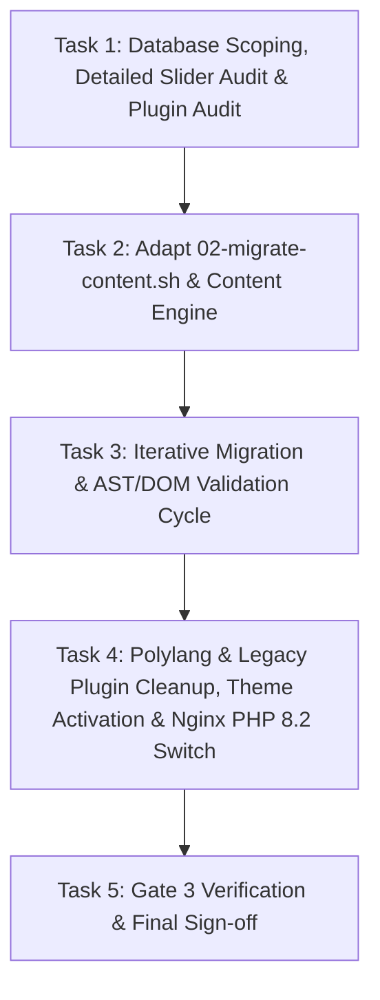

# Phase 3 Plan: Content Migration Engine & Gutenberg Conversion

**TOPIC NAME**: ekkairo-flagship  
**ISSUE NAME**: phase3-content-migration-gutenberg-conversion  

---

## 1. Objective

Execute the iterative content transformation pipeline on `backstage.ekkairo.org` (`backstage_ekk`). Audit installed plugins to explicitly disregard legacy builders, sliders, multi-language plugins (`polylang`), and obsolete utilities, adapt `bin/02-migrate-content.sh` and `bin/migration-content-engine.php` to scan Muffin Builder & LayerSlider data, convert page/post content into valid Gutenberg block markup, extract detailed LayerSlider and static slider media inventories to `ai-work/scopings/detailed-sliders-inventory.json`, deactivate legacy plugins/themes, validate block AST integrity, and transition Nginx to `php8.2-fpm.sock`.

---

## 2. Redesign Architecture & Content Directives

### General Site Architecture & Redesign Directives
1. **Sidebar Elimination**: All legacy sidebars are dropped completely in favor of full-width FSE layouts (`templates/page.html`, `templates/single.html`).
2. **BeTheme Options Disregard**: Global theme options from BeTheme are ignored except for essential assets:
   - Site Logo (`logo_url`, `logo_retina`, width/height)
   - Site Favicon / App Icon
   - Custom string translations / wording for UI elements
3. **Site Locale**: WordPress site language configured to **Greek (`el` / `el_GR`)**.
4. **Single Language Strategy**: Polylang deactivated; redundant English draft content safely purged.

### Content & Structure Migration Rules
- **Pages**: All page content and layout sections are migrated from Muffin Builder wrappers to clean, valid Gutenberg blocks (`core/columns`, `core/heading`, `core/paragraph`, `core/image`, `core/button`).
- **Posts**: All post content and inner layouts are fully migrated to Gutenberg block markup.
- **Homepage (Front Page)**: Homepage content is migrated, but the **legacy homepage LayerSlider and legacy layout structure are NOT converted**, as the homepage is being redesigned from scratch via FSE block templates.
- **LayerSliders & Static Sliders Detail Extraction**:
  - All 13 LayerSliders in `wp_layerslider` and 4 static gallery sliders have been fully detailed in `ai-work/scopings/detailed-sliders-inventory.json`.
  - Every slider entry logs: Slider ID, Slider Name, Slide Index, Background Image Attachment IDs, Original Image URLs (`http://ekkairo.org/wp-content/uploads/...`), Filenames, Sublayer images, and embedded Page/Post Permalinks.

---

## 3. Plugin Audit & Disregard Matrix

### Legacy Plugins to Disregard & Deactivate (Task 4 Target)
| Plugin Slug | Name | Status | Rationale for Disregard | Remediation Path |
| :--- | :--- | :--- | :--- | :--- |
| `polylang` | Polylang | Active | Multi-language plugin no longer needed; site content is single-language (Greek) with 0 English posts | Safe removal; default language set to Greek (`el_GR`) and Polylang deactivated |
| `polylang-theme-strings` | Polylang Theme Strings | Active | Redundant Polylang string translation plugin | Deactivated |
| `js_composer` | WPBakery Page Builder | Active | Legacy page builder; conflicts with Gutenberg | Content migrated to core Gutenberg blocks |
| `LayerSlider` | LayerSlider WP | Active | Legacy jQuery slider plugin | Detailed inventory exported to JSON; replaced by FSE Cover / Gallery blocks |
| `awesome-weather` | Awesome Weather Widget | Active | Unmaintained PHP 7 legacy widget | Disregarded; weather widget retired |
| `jetpack` | Jetpack by WordPress.com | Active | Bloated legacy plugin suite; unnecessary in FSE | Deactivated |
| `jetpack-boost` | Jetpack Boost | Inactive | Redundant performance suite | Deactivated |
| `google-captcha` | Google Captcha (reCAPTCHA) | Inactive | Legacy captcha causing staging friction | Deactivated |
| `w3-total-cache` | W3 Total Cache | Inactive | Legacy drop-in cache; conflicts with Nginx | Cache purged & disabled in favor of Nginx FastCGI |
| `ewww-image-optimizer` | EWWW Image Optimizer | Inactive | Obsolete image optimizer | Deactivated |
| `display-posts-shortcode` | Display Posts Shortcode | Active | Legacy query shortcode plugin | Replaced by native `core/query` block |
| `show-hide-author` | Show/Hide Author | Active | Legacy postmeta display hack | Handled cleanly in FSE template hierarchy |
| `mailchimp` | MailChimp for WP | Active | Outdated newsletter integration | Disregarded / Deactivated |
| `facebook-pixel` | Facebook Pixel | Active | Legacy tracking snippet | Disregarded / Deactivated |
| `manage-xml-rpc` | Manage XML-RPC | Active | Obsolete security plugin | XML-RPC access restricted at Nginx level |
| `php-compatibility-checker` | PHP Compatibility Checker | Active | Obsolete diagnostic script | Deactivated |
| `wp-missed-schedule-master` | WP Missed Schedule | Active | Obsolete 2014 cron workaround | Deactivated |

### Retained Functional & Utility Plugins
| Plugin Slug | Name | Status | Rationale for Retention |
| :--- | :--- | :--- | :--- |
| `contact-form-7` | Contact Form 7 | Active | Active contact form provider |
| `duplicate-post` | Yoast Duplicate Post | Active | Content editing & workflow utility |
| `user-role-editor` | User Role Editor | Active | Admin permission management utility |
| `pdf-embedder` | PDF Embedder | Active | Document embedding utility |
| `pdf-image-generator` | PDF Image Generator | Active | Document thumbnail generator |
| `cloudflare` | Cloudflare | Active | CDN / SSL helper integration |
| `aryo-activity-log` | Activity Log | Active | Admin audit logging utility |
| `disable-comments` | Disable Comments | Active | Comment governance utility |
| `force-regenerate-thumbnails` | Force Regenerate Thumbnails | Active | Utility for thumbnail regeneration after theme migration |

---

## 4. Assumptions & Architecture Options

### Stated Assumptions
1. **Pre-flight Baseline**: `bin/01-backstage-setup.sh` has already executed and the `backstage_ekk` database is initialized and ready.
2. **Orchestrator Script Adaptation**: `bin/02-migrate-content.sh` (previously pointing to `ekalexandria`) will be updated to target `/var/www/backstage.ekkairo.org` and `ekkairo-flagship`.
3. **Migration Engine Runtime**: Content migration scripts execute via WP-CLI under PHP 7.4/8.2 to process legacy Muffin Builder serialized meta before switching the web server environment to PHP 8.2-FPM.
4. **Single Language Strategy**: Polylang will be safely deactivated and single language mode (Greek `el_GR`) confirmed across core site settings.
5. **Human Verification Gate before Commit**: After completing each task, verification output will be presented to the human supervisor for explicit approval BEFORE committing changes to git.
6. **Iterative Incremental Workflow**: Migration is performed iteratively: **Scoping → Migration Run → Inspect Results → Adapt Engine → Re-run**.

---

## 5. Vertical Work Slices & Tasks

### Task 1: Database Scoping & Legacy Content Audit Execution
- **Deliverables**:
  - Run `bin/scope-betheme-config.php`, `bin/scope-legacy-items.php`, and `bin/scope-detailed-sliders.php` via WP-CLI on `backstage_ekk`.
  - Generate scoping reports: `ai-work/scopings/betheme-config-scoping.json`, `ai-work/scopings/mfn-pages.json`, `ai-work/scopings/legacy-items-inventory.json`, `ai-work/scopings/detailed-sliders-inventory.json`, and `ai-work/scopings/betheme-custom-css.css`.
  - Include plugin scoping audit validating the Disregard Matrix (including Polylang removal).
- **Acceptance Criteria**:
  - All 5 scoping JSON/CSS files created and populated without PHP errors.
  - Inventory accurately details 13 LayerSliders with image URLs/attachment IDs and page permalinks.
- **Verification**: Verify file existence and inspect JSON metrics in `ai-work/scopings/`. Stop for human verification before git commit.

### Task 2: Migration Orchestrator Adaptation & Content Engine Refinement
- **Deliverables**:
  - Update `bin/02-migrate-content.sh` to fix project paths (`/var/www/backstage.ekkairo.org`, theme `ekkairo-flagship`, log directory `ai-work/logs`).
  - Adapt `bin/migration-content-engine.php` for Muffin Builder sections/wraps/items, headings, text, buttons, and LayerSlider components according to page/post migration rules (bypassing homepage slider).
  - Implement Unmapped Shortcode Protocol: log any unhandled shortcodes to `ai-work/logs/unmapped-shortcodes.log`.
- **Acceptance Criteria**:
  - `bin/02-migrate-content.sh` executes cleanly without path or WP-CLI errors.
  - `ai-work/logs/unmapped-shortcodes.log` populated with detailed audit entries for human review.
- **Verification**: Run `bin/02-migrate-content.sh` and inspect execution logs. Stop for human verification before git commit.

### Task 3: Iterative Migration, AST & DOM Markup Validation Cycle
- **Deliverables**:
  - Execute AST validator (`bin/validate-ast.js`) and FSE block sanitizer (`bin/test-fse-sanitizer.php`).
  - Perform iterative refinement: Scoping → Migration Run → Inspect Results → Adapt Engine → Re-run until 0 invalid block errors remain.
- **Acceptance Criteria**:
  - Zero syntax errors or malformed block comments (`<!-- wp:... -->`) found across migrated posts/pages.
  - Gutenberg block editor validation passes without invalid content warnings.
- **Verification**: Execute `bin/test-fse-sanitizer.php` and `bin/validate-ast.js`. Stop for human verification before git commit.

### Task 4: Legacy Plugin Deactivation (including Polylang), Theme Activation & Nginx PHP 8.2 Switch
- **Deliverables**:
  - Safely remove/deactivate `polylang` and `polylang-theme-strings` plugins, purge remaining English draft content, and confirm site locale as Greek (`el_GR`).
  - Deactivate all 17 legacy plugins identified in the Disregard Matrix (`polylang`, `polylang-theme-strings`, `js_composer`, `LayerSlider`, `awesome-weather`, `jetpack`, `display-posts-shortcode`, `show-hide-author`, `mailchimp`, `facebook-pixel`, `manage-xml-rpc`, `php-compatibility-checker`, `wp-missed-schedule-master`, etc.) and legacy themes (`betheme`, `betheme-child`).
  - Activate `ekkairo-flagship` block theme.
  - Update Nginx site handler `backstage.ekkairo.org.conf` from `php7.4-fpm.sock` to `php8.2-fpm.sock` and reload Nginx service.
- **Acceptance Criteria**:
  - Polylang and legacy plugins/themes deactivated; `ekkairo-flagship` active.
  - Retained utility plugins remain active (`contact-form-7`, `duplicate-post`, etc.).
  - Site `backstage.ekkairo.org` responds HTTP 200 running on PHP 8.2-FPM in Greek locale (`el_GR`).
- **Verification**: `wp theme status`, `wp plugin list`, and Nginx PHP socket check. Stop for human verification before git commit.

### Task 5: Gate 3 Verification & Final Human Review Sign-Off
- **Deliverables**:
  - Complete full Gate 3 verification checklist.
  - Present `unmapped-shortcodes.log` and final migration metrics to human supervisor.
- **Acceptance Criteria**: All 7 criteria from `spec-phase3.md` Section 3 satisfied.

---

## 6. Dependency Graph

---

## 7. Token Cost & Optimization Analysis

| Task / Phase Step | Estimated Input Tokens | Estimated Output Tokens | Estimated Total Tokens | Estimated Cost (USD) |
| :--- | :--- | :--- | :--- | :--- |
| **Task 1: Scoping & Slider Audit** | ~20,000 | ~4,500 | ~24,500 | ~$0.13 |
| **Task 2: Migration Orchestrator & Engine** | ~35,000 | ~10,000 | ~45,000 | ~$0.26 |
| **Task 3: Iterative Migration & Validation** | ~25,000 | ~7,000 | ~32,000 | ~$0.18 |
| **Task 4: Polylang & Runtime Transition** | ~20,000 | ~5,000 | ~25,000 | ~$0.14 |
| **Task 5: Gate 3 Verification & Sign-off** | ~12,000 | ~3,000 | ~15,000 | ~$0.08 |
| **Total Estimated Phase 3 Cost** | **~112,000** | **~29,500** | **~141,500** | **~$0.79** |

*Note: Calculations based on standard blended LLM API rates ($3.00/1M input, $15.00/1M output tokens).*

---

## 8. Git & Approval Workflow

- **Human Approval Gate**: After completing each Task (Task 1 to Task 5), execution outputs and verification results will be submitted to the human supervisor. Git commit will ONLY occur upon explicit human approval.
- Working Branch: `phase-3-migration`
- Commit Milestones:
  - Task 1: `feat(migration): execute database scoping, detailed slider inventory and plugin disregard audit`
  - Task 2: `feat(migration): adapt 02-migrate-content.sh orchestrator and content engine`
  - Task 3: `test(gutenberg): complete iterative migration and AST/DOM block validation`
  - Task 4: `ops(runtime): deactivate polylang and legacy plugins, activate flagship theme, switch to php8.2-fpm`
  - Task 5: `docs(gate3): complete Phase 3 migration verification and sign-off report`
