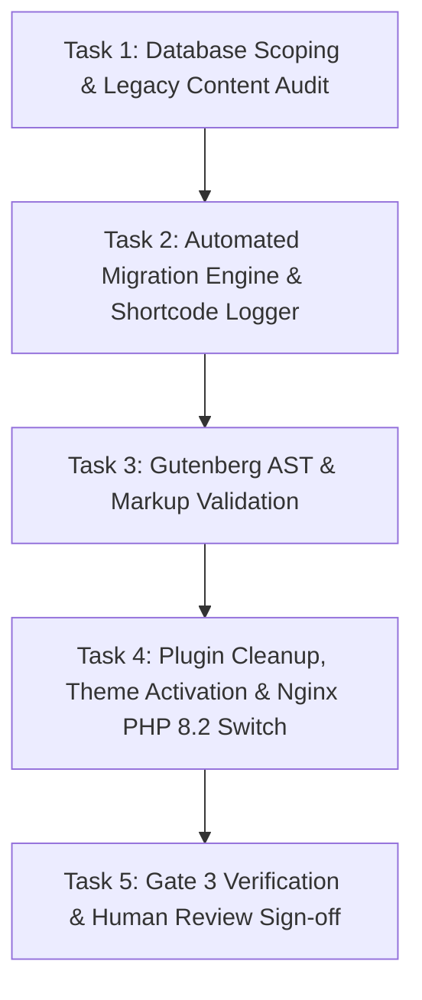

# Phase 3 Plan: Content Migration Engine & Gutenberg Conversion

**TOPIC NAME**: ekkairo-flagship  
**ISSUE NAME**: phase3-content-migration-gutenberg-conversion  

---

## 1. Objective

Execute the automated content transformation pipeline on `backstage_ekk`. Scan legacy Betheme Muffin Builder & LayerSlider data, convert shortcodes to valid Gutenberg block markup under PHP 7.4, log unmapped shortcodes to `ai-work/logs/unmapped-shortcodes.log`, deactivate legacy plugins/themes, validate block AST integrity, and transition Nginx to `php8.2-fpm.sock`.

---

## 2. Assumptions & Architecture Options

### Stated Assumptions
1. **Migration Runtime**: Content migration scripts run under PHP 7.4 to maintain compatibility with legacy Betheme classes/unserialization routines before switching the web server environment to PHP 8.2.
2. **Database Target**: Migration operates on the `backstage_ekk` staging database.
3. **Block Integrity**: Converted post content must produce zero "This block contains invalid content" recovery warnings when loaded in the WordPress Block Editor.
4. **Unmapped Shortcode Safety Protocol**: Any unmapped shortcodes or unknown Muffin Builder elements must not be silently discarded; they must be logged to `ai-work/logs/unmapped-shortcodes.log` for human audit.

### Architecture Trade-Off Options (Presented for Awareness)
- **Option A (Direct AST/DOM Block Construction - Recommended)**: Parse Muffin Builder grid/wrappers directly into native Gutenberg block structure comment nodes (`<!-- wp:columns -->`, `<!-- wp:heading -->`) using a clean transform pipeline. Ensures exact block schema adherence.
- **Option B (Regex Replacement + Classic-to-Gutenberg Parser)**: Convert shortcodes to intermediate HTML and pass through `wp.blocks.rawHandler`. Higher risk of invalid block structures or unexpected nesting errors.

---

## 3. Vertical Work Slices & Tasks

### Task 1: Database Scoping & Legacy Content Audit Execution
- **Deliverables**:
  - Run `bin/scope-betheme-config.php` and `bin/scope-legacy-items.php` via WP-CLI on `backstage_ekk`.
  - Generate scoping reports: `ai-work/scopings/betheme-config-scoping.json`, `ai-work/scopings/mfn-pages.json`, `ai-work/scopings/legacy-items-inventory.json`, and `ai-work/scopings/betheme-custom-css.css`.
- **Acceptance Criteria**:
  - All 4 scoping JSON/CSS files created and populated without fatal PHP errors.
  - Inventory accurately counts pages, MFN builder wrappers, sliders, and shortcodes.
- **Verification**: Verify file existence and inspect JSON metrics in `ai-work/scopings/`.

### Task 2: Automated Migration Engine Adaptation & Unmapped Shortcode Logging
- **Deliverables**:
  - Adapt `bin/migration-content-engine.php` to handle Muffin Builder grids, columns, headings, text, buttons, and LayerSlider components.
  - Implement Unmapped Shortcode Protocol: log any unhandled shortcodes/tags to `ai-work/logs/unmapped-shortcodes.log`.
  - Execute migration engine under PHP 7.4.
- **Acceptance Criteria**:
  - `migration-content-engine.php` runs to completion with zero fatal errors under PHP 7.4.
  - Post contents updated in DB with structured `wp:` block markup.
  - `ai-work/logs/unmapped-shortcodes.log` generated with detailed audit entries for human review.
- **Verification**: Run `bin/migration-content-engine.php` and review execution output and log files.

### Task 3: Gutenberg AST & DOM Markup Validation
- **Deliverables**:
  - Execute AST validator (`bin/validate-ast.js`) and FSE block sanitizer (`bin/test-fse-sanitizer.php`).
  - Audit block syntax against WordPress Gutenberg block schemas (`core/columns`, `core/heading`, `core/paragraph`, `core/image`, `core/button`).
- **Acceptance Criteria**:
  - Zero syntax errors or malformed block comments (`<!-- wp:... -->`) found.
  - All posts pass block editor validation without triggering invalid block recovery prompts.
- **Verification**: Run `bin/test-fse-sanitizer.php` and `bin/validate-ast.js`.

### Task 4: Runtime Transition, Plugin Cleanup & Nginx Switch
- **Deliverables**:
  - Execute setup and plugin management script (`bin/01-backstage-setup.sh`).
  - Deactivate legacy Betheme theme, Betheme-Child, LayerSlider, Muffin Builder, Jetpack, and obsolete plugins via WP-CLI.
  - Activate `ekkairo-flagship` block theme.
  - Update Nginx configuration (`backstage.ekkairo.org.conf`) to target `php8.2-fpm.sock` and reload Nginx service.
- **Acceptance Criteria**:
  - Legacy plugins and themes deactivated; `ekkairo-flagship` active.
  - Site `backstage.ekkairo.org` responds HTTP 200 running on PHP 8.2-FPM.
- **Verification**: `wp theme status`, `wp plugin list`, and Nginx PHP status check (`php -v` / socket test).

### Task 5: Gate 3 Verification & Human Review Sign-Off
- **Deliverables**:
  - Complete full Gate 3 verification checklist.
  - Present `unmapped-shortcodes.log` and migration stats to human supervisor.
- **Acceptance Criteria**: All 7 criteria from `spec-phase3.md` Section 3 satisfied.

---

## 4. Dependency Graph

---

## 5. Token Cost & Optimization Analysis

| Task / Phase Step | Estimated Input Tokens | Estimated Output Tokens | Estimated Total Tokens | Estimated Cost (USD) |
| :--- | :--- | :--- | :--- | :--- |
| **Task 1: Database Scoping & Content Audit** | ~15,000 | ~3,000 | ~18,000 | ~$0.09 |
| **Task 2: Migration Engine & Shortcode Protocol** | ~35,000 | ~10,000 | ~45,000 | ~$0.26 |
| **Task 3: Gutenberg AST & Block Validation** | ~20,000 | ~5,000 | ~25,000 | ~$0.14 |
| **Task 4: Runtime Transition & Nginx Switch** | ~18,000 | ~4,000 | ~22,000 | ~$0.11 |
| **Task 5: Gate 3 Verification & Sign-off** | ~12,000 | ~3,000 | ~15,000 | ~$0.08 |
| **Total Estimated Phase 3 Cost** | **~100,000** | **~25,000** | **~125,000** | **~$0.68** |

*Note: Calculations based on standard blended LLM API rates ($3.00/1M input, $15.00/1M output tokens).*

---

## 6. Git Workflow

- Working Branch: `phase-3-migration`
- Commit Milestones:
  - Task 1: `feat(migration): execute database scoping and legacy inventory audit`
  - Task 2: `feat(migration): adapt content engine and implement unmapped shortcode logger`
  - Task 3: `test(gutenberg): validate block markup AST and DOM sanitizer compliance`
  - Task 4: `ops(runtime): deactivate legacy plugins, activate flagship theme, switch to php8.2-fpm`
  - Task 5: `docs(gate3): complete Phase 3 migration verification and sign-off report`
