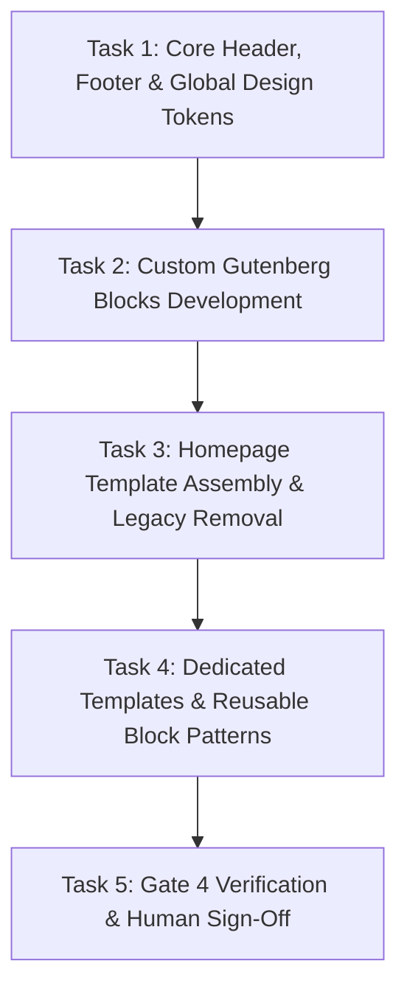

# Phase 4 Plan: UI/UX Redesign Implementation (Readdy Design System)

**TOPIC NAME**: ekkairo-flagship  
**ISSUE NAME**: phase4-ui-ux-redesign  

---

## 1. Objective

Implement the complete visual UI/UX redesign for `ekkairo-flagship` on `backstage.ekkairo.org`, based on the approved Readdy design system preview (`https://readdy.cc/preview/1d954d61-ec69-4ca4-9643-e0a7fc396a55/12913398/`) and `Rebirth Meeting 2026-07-29.md`. Build custom dynamic Gutenberg blocks (`blocks/hero-slider`, `blocks/news-grid`, `blocks/subscribe-card`, `blocks/publications-banner`), assemble the complete 7-section homepage (`templates/front-page.html`), build dedicated template layouts (`templates/page-publications.html`, Contact page 3-language layout, Header/Footer parts), register reusable FSE patterns in `patterns/`, and strictly enforce the deletion of legacy elements (sidebars, weather widget, focus section, churches section).

---

## 2. Technical Deliverables & Architecture

### Custom Dynamic Gutenberg Blocks (`blocks/`)
1. **Hero News Slider Block (`blocks/hero-slider`)**: Dynamic PHP block displaying the 3 latest sticky/featured news posts with featured image background, dark gradient overlay, typography overlay, slide controls, and smooth transition.
2. **News Grid Block (`blocks/news-grid`)**: Dynamic PHP block displaying 7 latest news posts in a structured grid + an 8th card CTA leading to the full news archive (`/news` or category archive).
3. **Neo Fos Subscribe Block (`blocks/subscribe-card`)**: Styled newsletter subscription card block for the "Neo Fos" publication.
4. **Community Publications Banner (`blocks/publications-banner`)**: Visual banner block linking to the new Community Publications page with inquiry CTA.

### Templates & Template Parts
1. **Homepage Template (`templates/front-page.html`)**:
   - Section 1: Hero News Slider Block (`blocks/hero-slider`)
   - Section 2: Welcome Block (`Καλώς ήλθατε`)
   - Section 3: News Grid Block (`blocks/news-grid`, 7 posts + 8th archive CTA card)
   - Section 4: About / Purpose & Embassies Grid (`Ίδρυση – Σκοπός & Embassies`)
   - Section 5: Neo Fos Subscribe Block (`blocks/subscribe-card`)
   - Section 6: Social Media Attraction Banner (Facebook, Instagram, YouTube)
   - Section 7: Community Publications Banner (`blocks/publications-banner`)
   - **Enforced Deletions**: Sidebars, weather widget, churches section, and focus section completely absent.
2. **Community Publications Page (`templates/page-publications.html`)**: Dedicated page layout displaying community publications, historical archives, and inquiry buttons.
3. **Contact Page Layout**: 3-language discovery block (Greek, Arabic, English text blocks for location/contact info).
4. **Header Template Part (`parts/header.html`)**: Fluid logo scaling, primary navigation menu, clean header utility links. Includes sticky overlay behavior: starts transparent over full-width hero carousel and animates/transitions to solid white background on page scroll.
5. **Footer Template Part (`parts/footer.html`)**: Community links, institutional copyright, social icons footer layout.

### Reusable Block Patterns (`patterns/`)
- Register FSE patterns for hero sections, news cards, publication banners, and content callouts.

---

## 3. Assumptions & Architecture Options

### Stated Assumptions
1. **Phase 3 Baseline**: Phase 3 content migration and plugin cleanup are complete; site runs on PHP 8.2-FPM with `ekkairo-flagship` active.
2. **Dynamic PHP Blocks**: Dynamic blocks will be registered using `@wordpress/scripts` / `block.json` with PHP `render_callback` or `render.php` files under `blocks/`.
3. **Header Scroll Dynamics**: Header is positioned over the hero carousel starting fully transparent with white/light text and transitions via scroll listener (`src/index.js` / CSS class toggle) to a solid white background with dark navigation text.
4. **Strict Scope discipline**: Legacy sidebars, weather widget, churches section, and focus section are fully deleted from all main templates.
5. **Human Review Gate**: Verification output for each task will be presented to the human supervisor before proceeding or committing code.

---

## 4. Vertical Work Slices & Tasks

### Task 1: Core Header, Footer & Global Design System Polish (including Header Scroll Transition)
- **Deliverables**:
  - Update `parts/header.html` with fluid logo scaling, responsive navigation, and header utility links.
  - Implement sticky transparent-to-white scroll transition in `src/index.js` & `src/index.scss` (header starts transparent over full-width carousel and animates to white background on scroll).
  - Update `parts/footer.html` with community links, copyright, social icons layout.
  - Refine global design system CSS in `src/index.scss` and compile via `@wordpress/scripts` (`npm run build`).
- **Acceptance Criteria**:
  - Header starts transparent over hero carousel and smoothly transitions to solid white on scroll down.
  - Header and footer render cleanly with fluid responsive scaling across mobile/desktop viewports.
  - Build script completes with zero errors (`build/index.css` and `build/index.js` generated).
- **Verification**: DOM & JS scroll trigger verification of `parts/header.html` and header class toggling plus asset compilation check.

### Task 2: Custom Gutenberg Blocks Development (`blocks/`)
- **Deliverables**:
  - Implement `blocks/hero-slider` (dynamic PHP render querying 3 latest sticky/featured news posts, image overlays, transitions).
  - Implement `blocks/news-grid` (dynamic PHP render querying 7 posts + 8th card archive CTA).
  - Implement `blocks/subscribe-card` (Neo Fos newsletter subscription block).
  - Implement `blocks/publications-banner` (Community Publications banner block).
  - Enqueue block styles/scripts and test block rendering.
- **Acceptance Criteria**:
  - All 4 dynamic blocks registered and render correctly in both block editor and frontend.
  - `hero-slider` displays 3 latest posts with images; `news-grid` displays 7 posts + 8th archive CTA card.
- **Verification**: Test block PHP render callbacks via WP-CLI / REST API or test page rendering.

### Task 3: Homepage Template Assembly & Legacy Removal (`templates/front-page.html`)
- **Deliverables**:
  - Rebuild `templates/front-page.html` with all 7 specified sections in exact order.
  - Ensure complete removal of legacy focus section, churches section, weather widget, and sidebars.
- **Acceptance Criteria**:
  - Front page renders all 7 sections cleanly matching Readdy specifications.
  - Zero legacy sidebar or retired widget elements present in DOM.
- **Verification**: HTTP GET check on `https://backstage.ekkairo.org/` and DOM structure analysis.

### Task 4: Dedicated Templates & Reusable Block Patterns (`templates/page-publications.html`, Contact Layout, `patterns/`)
- **Deliverables**:
  - Create `templates/page-publications.html` template layout for community publications and historical archives.
  - Create Contact page 3-language discovery layout (Greek, Arabic, English text blocks).
  - Register reusable block patterns in `patterns/` (hero sections, news cards, publication banners, content callouts).
- **Acceptance Criteria**:
  - `page-publications.html` template available and functional in Site Editor / page creation.
  - Contact layout handles trilingual text blocks cleanly.
  - Patterns registered and selectable in Gutenberg inserter.
- **Verification**: Verify pattern registration via WP-CLI (`wp block-pattern list`) and inspect template file valid block syntax.

### Task 5: Gate 4 Verification & Human Review Sign-Off
- **Deliverables**:
  - Run full audit against all 7 Gate 4 acceptance criteria in `spec-phase4.md`.
  - Present verification report to human supervisor for explicit approval.
- **Acceptance Criteria**: All Gate 4 checklist items passed.

---

## 5. Dependency Graph

---

## 6. Token Cost & Optimization Analysis

| Task / Phase Step | Estimated Input Tokens | Estimated Output Tokens | Estimated Total Tokens | Estimated Cost (USD) |
| :--- | :--- | :--- | :--- | :--- |
| **Task 1: Header, Footer & Tokens** | ~20,000 | ~4,500 | ~24,500 | ~$0.13 |
| **Task 2: Gutenberg Blocks Development** | ~40,000 | ~12,000 | ~52,000 | ~$0.30 |
| **Task 3: Homepage Template Assembly** | ~30,000 | ~8,000 | ~38,000 | ~$0.21 |
| **Task 4: Dedicated Templates & Patterns** | ~25,000 | ~7,000 | ~32,000 | ~$0.18 |
| **Task 5: Gate 4 Verification & Sign-off** | ~15,000 | ~4,000 | ~19,000 | ~$0.10 |
| **Total Estimated Phase 4 Cost** | **~130,000** | **~35,500** | **~165,500** | **~$0.92** |

*Note: Calculations based on standard blended LLM API rates ($3.00/1M input, $15.00/1M output tokens).*

---

## 7. Git & Approval Workflow

- **Human Approval Gate**: After completing each task, execution outputs will be submitted for human review. Git commits will occur ONLY upon explicit human approval.
- Working Branch: `master` (or `phase-4-ui-redesign`)
- Commit Milestones:
  - Task 1: `feat(theme): polish header and footer template parts with fluid scaling design system`
  - Task 2: `feat(blocks): implement custom dynamic gutenberg blocks hero-slider, news-grid, subscribe-card, publications-banner`
  - Task 3: `feat(templates): assemble 7-section front-page template and remove legacy widgets/sections`
  - Task 4: `feat(patterns): create publications template, contact page layout and reusable block patterns`
  - Task 5: `docs(gate4): complete Phase 4 UI/UX redesign verification and sign-off report`
